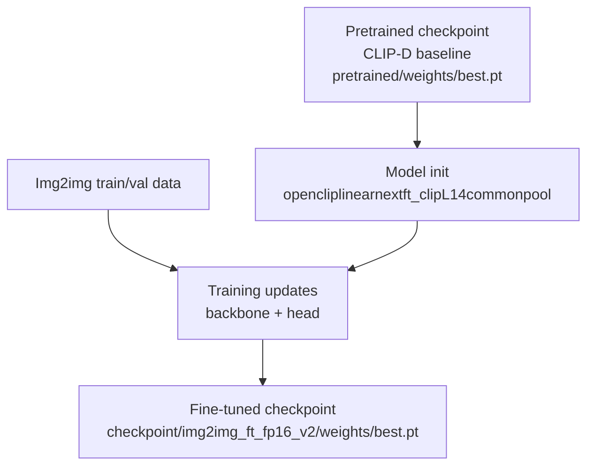

# Img2img CLIP-D Fine-Tuning Guide

This guide documents how we prepared the img2img dataset, fine-tuned CLIP-D, and evaluated the final model. It also explains why we chose full-image training instead of patch/grid inference.

Note on commands:
- Commands marked "Used in this run" are those we executed in this workspace.
- Other commands are reproducibility steps (use them if you need to regenerate splits/data).

## 1) Dataset creation

### 1.1 Real images (cropped)

We crop the real images to a centered 1024x1024 square. This must match the img2img pipeline so that the only difference between real and fake pairs is the img2img process itself.

Input folder:
- `/media/CrispyMcMarkInc/Real_cropped_1024`

### 1.2 Train/val/test split (image-wise)

Create split lists from the real images. This ensures that all fakes derived from a given real image stay in the same split.

Status: Repro step (use if you need to re-create the splits)

```bash
python /media/CrispyMcMarkInc/prepare_img2img_splits.py \
  --input_dir /media/CrispyMcMarkInc/Real_cropped_1024 \
  --output_dir /media/CrispyMcMarkInc/splits \
  --limit 500 \
  --train_ratio 0.7 --val_ratio 0.15 --test_ratio 0.15
```

This writes:
- `/media/CrispyMcMarkInc/splits/img2img_train.txt`
- `/media/CrispyMcMarkInc/splits/img2img_val.txt`
- `/media/CrispyMcMarkInc/splits/img2img_test.txt`

### 1.3 Generate img2img fakes for each split

We generate fakes from the same split lists so each split remains clean.

Status: Repro step (use if you need to re-generate fakes)

```bash
python /media/CrispyMcMarkInc/generate_images_img2img_splits.py \
  --split_dir /media/CrispyMcMarkInc/splits \
  --prefix img2img \
  --splits train val test \
  --output_root /media/CrispyMcMarkInc/fake-images-img2img \
  --models sd15 sd3 sd35 \
  --quantizations fp16 \
  --strength 0.3 --steps 30 --guidance 3.5 \
  --device cuda
```

### 1.4 Build CSV manifests for training

We build CSVs that include both real and fake images for each split.

Status: Used in this run

```bash
python /media/CrispyMcMarkInc/generate_img2img_manifests.py \
  --split_dir /media/CrispyMcMarkInc/splits \
  --output_dir /media/CrispyMcMarkInc/manifests \
  --fake_root /media/CrispyMcMarkInc/fake-images-img2img
```

Outputs:
- `/media/CrispyMcMarkInc/manifests/img2img_train.csv`
- `/media/CrispyMcMarkInc/manifests/img2img_val.csv`
- `/media/CrispyMcMarkInc/manifests/img2img_test.csv`

---

## 2) Fine-tuning CLIP-D

We fine-tune the OpenCLIP backbone and head using the new architecture `opencliplinearnextft_clipL14commonpool`. This allows gradients to flow through the CLIP backbone. The pretrained weights are used as initialization and are not overwritten.

### 2.1 Training command

Status: Used in this run

```bash
/media/CrispyMcMarkInc/.venvs/detector/bin/python \
  /media/CrispyMcMarkInc/Image-Deepfake-Detectors-Public-Library/detectors/CLIP-D/train.py \
  --name img2img_ft_fp16_v2 \
  --arch opencliplinearnextft_clipL14commonpool \
  --task train \
  --device cuda:0 \
  --csv_train /media/CrispyMcMarkInc/manifests/img2img_train.csv \
  --csv_val /media/CrispyMcMarkInc/manifests/img2img_val.csv \
  --csv_test /media/CrispyMcMarkInc/manifests/img2img_test.csv \
  --pretrained_weights /media/CrispyMcMarkInc/Image-Deepfake-Detectors-Public-Library/detectors/CLIP-D/checkpoint/pretrained/weights/best.pt \
  --batch_size 8 \
  --lr 5e-5 \
  --backbone_lr 1e-6 \
  --num_epoches 20 \
  --earlystop_epoch 3
```

Checkpoints are saved to:
- `/media/CrispyMcMarkInc/checkpoint/img2img_ft_fp16_v2/weights/best.pt`

### 2.2 Checkpoint provenance and what "pretrained" means

There are two different "best.pt" files involved, and they live in different folders. The names are the same, but they are not the same weights:

1) **Pretrained CLIP-D checkpoint (baseline, older model)**
- Path: `/media/CrispyMcMarkInc/Image-Deepfake-Detectors-Public-Library/detectors/CLIP-D/checkpoint/pretrained/weights/best.pt`
- This file already existed in the repository before this run. It is the baseline CLIP-D model distributed with the public library.
- We use it only as initialization via `--pretrained_weights`. It is read from disk and loaded into memory, but it is never modified or overwritten.

2) **Fine-tuned checkpoint (this run)**
- Path: `/media/CrispyMcMarkInc/checkpoint/img2img_ft_fp16_v2/weights/best.pt`
- This file is newly created by our training run. It contains the weights after fine-tuning on the img2img dataset.

What happens during training, step by step:

- The model is created with the requested architecture (`opencliplinearnextft_clipL14commonpool`).
- The pretrained checkpoint is loaded into that model as a starting point (it is just a source of initial weights).
- Training updates the weights based on the img2img train/val data.
- The best-performing weights are written to the run-specific output folder under `/media/CrispyMcMarkInc/checkpoint/...`.



So when we say "checkpoint" in this report, it can refer to either:
- the **pretrained checkpoint** that came with the repo (baseline, older model), or
- the **fine-tuned checkpoint** produced by this run.

They are separate files, and the baseline pretrained file remains unchanged.

---

## 3) Testing and evaluation

### 3.1 Run test on the held-out test CSV

Status: Used in this run

```bash
/media/CrispyMcMarkInc/.venvs/detector/bin/python \
  /media/CrispyMcMarkInc/Image-Deepfake-Detectors-Public-Library/detectors/CLIP-D/test.py \
  --name img2img_ft_fp16_v2 \
  --arch opencliplinearnextft_clipL14commonpool \
  --task test \
  --device cuda:0 \
  --csv_test /media/CrispyMcMarkInc/manifests/img2img_test.csv
```

Results are written to:
- `/media/CrispyMcMarkInc/results/img2img_ft_fp16_v2/data/None/metrics.json`

### 3.2 Folder-level detection CSV (optional)

If you want a CSV for a flat folder of images:

Status: Optional (use when you want a flat-folder CSV)

```bash
/media/CrispyMcMarkInc/.venvs/detector/bin/python \
  /media/CrispyMcMarkInc/run_detection_img2img.py \
  --input_dir /media/CrispyMcMarkInc/fake-images-img2img \
  --results_csv /media/CrispyMcMarkInc/detector_img2img_results.csv \
  --clipd_mode default \
  --clipd_arch opencliplinearnextft_clipL14commonpool \
  --weights_name img2img_ft_fp16_v2
```

---

## 4) Why full-image fine-tuning beats patch/grid mode

We tried patch/grid inference (224x224 crops with aggregation). That approach is good for localization but it performs poorly for whole-image classification in this setting.

Key reasons:

1. **Training mismatch**: CLIP-D is trained on full images (resized to 224x224), not on isolated patches. Patches break global context.
2. **Context loss**: A 224x224 crop of a real image often lacks semantic context and can look unnatural, causing false positives.
3. **Aggregation amplifies errors**: Max and majority aggregations are sensitive to a few bad patches, which greatly increases false positives.
4. **Img2img artifacts are subtle**: The best signal appears when the model sees the *whole scene* and can compare global statistics, not just local textures.

Fine-tuning the model directly on full-image real vs img2img pairs teaches it exactly the subtle differences introduced by the pipeline, while preserving strong real-image recognition.

---

## 4.1) Why we fine-tuned the backbone (not just the head)

We initially tried a frozen OpenCLIP backbone with a linear head. Validation performance plateaued around AUC ~0.65, which showed that the frozen features were not linearly separable for this subtle img2img task.

Because the img2img strength is low (0.3), the edits are very subtle and the pretrained backbone did not emphasize those cues. Allowing a small backbone learning rate (`--backbone_lr 1e-6`) let the feature space adapt to the specific artifacts introduced by our pipeline, while keeping real-image accuracy strong. This change is what produced the large jump in TPR and AUC during validation and test.

---

## 5) Summary

- We created clean train/val/test splits at the real-image level.
- We generated matched fakes for each split using the same img2img pipeline.
- We fine-tuned CLIP-D using CSV manifests and a fine-tunable OpenCLIP backbone.
- The fine-tuned model achieved high TPR and TNR on the held-out test set.
- Full-image fine-tuning clearly outperformed patch/grid inference.
